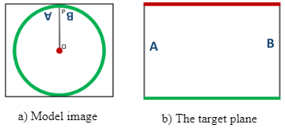
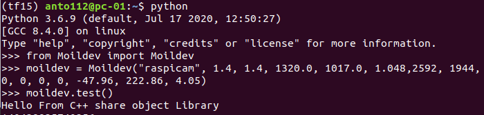
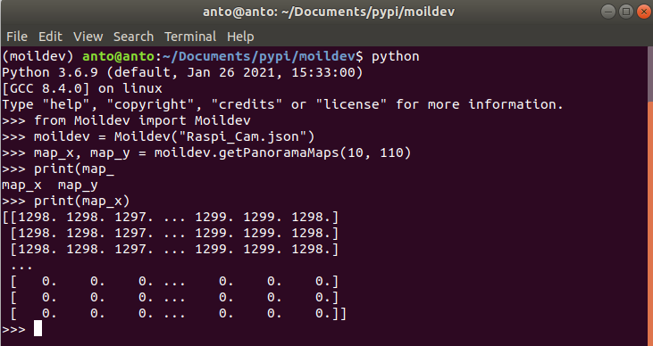
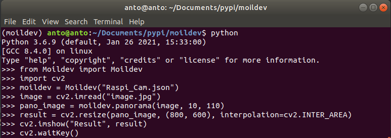

## Moildev Library

Moildev Library is a collection of functions support python to developments fisheye image applications.

- Anypoint image


- Panorama Image 



## 1. How to install
This library now available in pypi distribution. install the newest version. visit link here https://pypi.org/project/Moildev/ 
```
$ pip install moildev or $ pip3 install moildev
```

### 2. Import Library

import moildev library:

```
>> from Moildev import Moildev
```

### 3. Application programming interface (API) Reference

To test this API using image from calibrated fish-eye camera, you can download the image from [this link](https://drive.google.com/file/d/1Cq8vIcsE7I8NYcL_nb8k7OBYjy9LLCx6/view?usp=sharing). the original image is showing bellow:


##### 3.1 Create Object

To create the object from Moildev, you have to provide the parameter. The camera parameter is the result from calibration camera by MOIL laboratory that will store on **.json** file.

```
moildev = Moildev("Camera_Parameter_Path")
```

**Parameter:**

Camera_Parameter_Path : The path of the *.json* file that stored the camera parameter from calibration result.

**Example:**

```
>> moildev = Moildev("Raspi_Cam.json")
```

##### 3.2 test

```
moildev.test()
```

**Purpose:**

The function will return feedback from share object library to make sure the library work properly.

**Example:**

```
>> from Moildev import Moildev
>> moildev = Moildev("Raspi_Cam.json")
>> moildev.test()
```

When you run the code, the output will be:

```
Hello From C++ share object Library
```

Example:



##### 3.3 **Create anypoint maps**

```
map_x, map_y = moildev.getAnypointMaps(alpha, beta, zoom, mode=1)
```

**Purpose:**

The purpose is to generate a pair of X-Y Maps for the specified alpha, beta and zoom parameters, the result X-Y Maps can be used later to remap the original fish-eye image to the target angle image.

**Parameter:**

```
. alpha: alpha
. beta: beta
. zoom: decimal zoom factor, normally 1..12
. selection anypoint mode(1 or 2), by default if will be mode 1
```

**Example :**

```
>> from Moildev import Moildev
>> moildev = Moildev("Raspi_Cam.json")
>> map_x, map_y = moildev.getAnypointMaps(0, 60, 4, 1)
>> print(map_x)
```

**Create file contain the code above, then running by python.**


##### 3.4 Anypoint 

```
anypoint_image = moildev.anypoint(image, alpha, beta, zoom, mode=1)
```

**Purpose :**

Generate anypoint view image. For mode 1, the result rotation is betaOffset degree rotation around the Z-axis(roll) after alphaOffset degree rotation around the X-axis(pitch). for mode 2, The result rotation is theta_Y degree rotation around the Y-axis(yaw) after theta_X degree rotation around the X-axis(pitch).

**Parameter:**

```
. image: source image
. alpha: alpha
. beta: beta
. zoom: zoom
. mode: mode anypoint view (by default it will be mode 1)
```

**Example :**

```
>> from Moildev import Moildev
>> moildev = Moildev("Raspi_Cam.json")
>> image = cv2.imread("image.jpg")
>> anypoint_image = moildev.anypoint(image, 0, 45, 4, 2)
>> result = cv2.resize(anypoint_image, (800, 600), interpolation=cv2.INTER_AREA)
>> cv2.imshow("Result", result)
>> cv2.waitKey(0)
```


The result:


##### 3.5 Create panorama maps

```
map_x, map_y = moildev.getPanoramaMaps(alpha_min, alpha_max)
```

**Purpose :**

To generate a pair of X-Y Maps for alpha within 0..alpha_max degree, the result X-Y Maps can be used later to generate a panorama image from the original fish-eye image. 

**Parameter:**

```
. alpha_min = the minimum alpha 
. alpha_max = the maximum of alpha. The recommended vaule is half of camera FOV. For 	example, use 90 for a 180 degree fisheye images and use 110 for a 220 degree fisheye images.
```

**Example :**

```
>> from Moildev import Moildev
>> moildev = Moildev("Raspi_Cam.json")
>> map_x, map_y = moildev.getPanoramaMaps(10, 110)
>> print(map_x)
```



**2.6 Panorama**

```
panorama_image = moildev.panorama(image, alpha_min, alpha_max)
```

**Purpose:**

The panorama image centered at the 3D direction with alpha = iC_alpha_degree and beta = iC_beta_degree.

**Parameter:**

```
. image = the original image  
. alpha_min = the minimum alpha 
. alpha_max : max of alpha. The recommended vaule is half of camera FOV. For example, use
  90 for a 180 degree fisheye images and use 110 for a 220 degree fisheye images.
```

**Example :**

```
>> from Moildev import Moildev
>> moildev = Moildev("Raspi_Cam.json")
>> image = cv2.imread("image.jpg")
>> pano_image = moildev.panorama(image, 10, 110)
>> result = cv2.resize(pano_image, (800, 600), interpolation=cv2.INTER_AREA)
>> cv2.imshow("Result", result)
>> cv2.waitKey(0)
```



The result:


### 4. About Us

Omnidirectional, Surveillance and Imaging laboratory (OIL-Lab) Ming Chi University of Technology, Taiwan***

