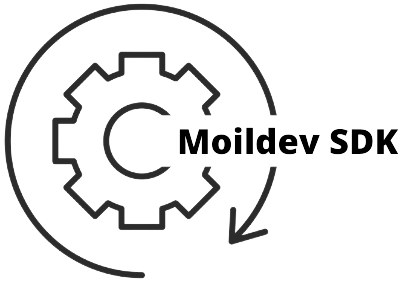

<p align="center"></p>

---

Moildev Library is a collection of functions that support the development of fisheye image applications based on python programing language. You can refer to this link to going deep on this library. currently the library can support for:

Linux OS                                                  | Windows os       | Mac OS X 
----------------------------------------------------------|------------------|---
python 3.6 .. 3.10| python 3.6 .. 3.10 | Under development 


### 1. How to install
This library now available in pypi distribution **[here](https://pypi.org/project/Moildev/)** , to install using python package index(PyPI) distribution, you can use the command bellow.

```python
pip3 install moildev
```
Or you can install manually by clone this repository to your local directory, then follow this command:

```
cd Moildev
pip install -r requirments.txt
pip install Moildev
```

### 2. Get in with Moildev library:

##### 2.1 Create Object

>Import library

```
from Moildev import Moildev
```

Each fisheye camera can be calibrated and derives a set of parameters by MOIL laboratory, before the successive functions can work correctly, configuration is necessary in the beginning of program. To create the object from Moildev, you have to pass the camera parameter to the package. There 3 way to create object of moildev:

  1. Create object using **input keyword arguments**
  2. Create object using **one parameter** with json file format extension 
  3. Create object using **multiple parameter** with json file format extension

>List of camera parameters keyword used to create moildev objects:

- cameraName = the name of the camera used
- cameraFov = camera field of view (FOV)
- sensorWidth = size of sensor width
- sensorHeight = size of sensor height
- icx = center image in x-axis
- icy = center image in y-axis
- ratio = the value of the ratio image
- imageWidth = the size of width image
- imageHeight = the size of height image
- calibrationRatio = the value of calibration ratio
- parameter0 .. parameter5= intrinsic fisheye camera parameter get from calibration

For more information about create object you can read [this example](https://github.com/MoilOrg/moildev/tree/main/examples/getting_started)

##### 2.2 **Create anypoint maps**

```buildoutcfg
map_x, map_y = moildev.getAnypointMaps(alpha, beta, zoom, mode=1)
```

**Purpose:**

>The purpose is to generate a pair of X-Y Maps for the specified alpha, beta and zoom parameters, the result X-Y Maps can be used later to remap the original fish-eye image to the target angle image.

**Parameter:**

```buildoutcfg
. alpha: alpha
. beta: beta
. zoom: decimal zoom factor, normally 1..12
. selection anypoint mode(1 or 2), by default if will be mode 1
```

See [example](https://github.com/MoilOrg/moildev/tree/main/examples/anypoint)

##### 2.3 Anypoint 

```
anypoint_image = moildev.anypoint(image, alpha, beta, zoom, mode=1)
```

**Purpose :**

> Generate anypoint view image. For mode 1, the result rotation is betaOffset degree rotation around the Z-axis(roll) after alphaOffset degree rotation around the X-axis(pitch). for mode 2, The result rotation is theta_Y degree rotation around the Y-axis(yaw) after theta_X degree rotation around the X-axis(pitch).

**Parameter:**

```buildoutcfg
. image: source image
. alpha: alpha
. beta: beta
. zoom: zoom
. mode: mode anypoint view (by default it will be mode 1)
```

See [example](https://github.com/MoilOrg/moildev/tree/main/examples/anypoint)

##### 2.4 Create panorama maps

```buildoutcfg
map_x, map_y = moildev.getPanoramaMaps(alpha_min, alpha_max)
```

**Purpose :**

> To generate a pair of X-Y Maps for alpha within 0..alpha_max degree, the result X-Y Maps can be used later to generate a panorama image from the original fish-eye image. 

**Parameter:**

```buildoutcfg
. alpha_min = the minimum alpha 
. alpha_max = the maximum of alpha. The recommended vaule is half of camera FOV. For 	example, use 90 for a 180 degree fisheye images and use 110 for a 220 degree fisheye images.
```

See [example](https://github.com/MoilOrg/moildev/tree/main/examples/panorama)

**2.5 Panorama**

```
panorama_image = moildev.panorama(image, alpha_min, alpha_max)
```

**Purpose:**

> The panorama image centered at the 3D direction with alpha = iC_alpha_degree and beta = iC_beta_degree.

**Parameter:**

```buildoutcfg
. image = the original image  
. alpha_min = the minimum alpha 
. alpha_max : max of alpha. The recommended vaule is half of camera FOV. For example, use
  90 for a 180 degree fisheye images and use 110 for a 220 degree fisheye images.
```

See [example](https://github.com/MoilOrg/moildev/tree/main/examples/panorama)

##### 2.6 Reverse view

```
reverse = moildev.panorama(image, alpha_max, alpha, beta)
```

**Purpose:**
> This function was used for transforming the fisheye image to change the optical point without 
> manipulating the camera head.

**Parameter:**
```buildoutcfg
- image = The original fisheye image
- alpha_max = max of alpha. The recommended value is half of camera FOV.
- alpha = the value of alpha
- beta = the value of alpha
```

See [example](https://github.com/MoilOrg/moildev/tree/main/examples/Reverse_view)

### 3. About Us

***Ming-Chi Omni-directional, Surveillance, and Imaging laboratory (MOIL-Lab), Ming Chi University of Technology, Taiwan***

